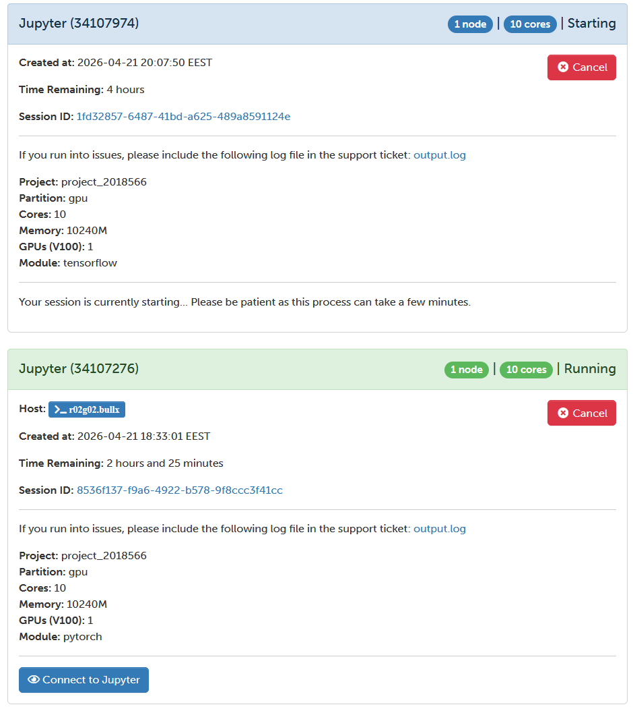
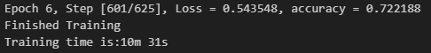
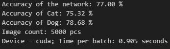
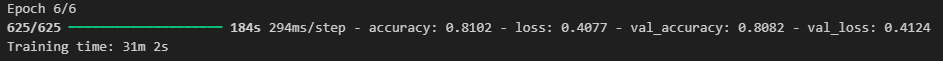

# Tulokset ja vertailu

Molemmat notebookit ajettiin samanlaisessa ajoympäristössä, datasetti ladattiin kagglesta ja neuroverkot koulutettiin [tehtävänannon](Task_1_1.md) kuvaamalla tavalla.

Datasetissä oli 2 vioittunutta kuvaa jotka piti poistaa `Dog/11702.jpg` & `Cat/666.jpg`

## PyTorch

PyTorch pääsi 77% tarkkuuteen ja sen kouluttamisessa kesti  noin 10 min.

## Tensorflow

Tensorflow pääsi 81% tarkkuuteen ja sen kouluttamisessa kesti noin 30 min.

## Vertailu

PyTorch ja TensorFlow tuottivat samankaltaisia tuloksia, mutta niiden käyttö erosi selvästi.

PyTorch-malli saavutti noin 77 % tarkkuuden ja koulutus kesti noin 10 minuuttia. TensorFlow-malli saavutti hieman paremman tarkkuuden, noin 81 %, mutta koulutus kesti pidempään, noin 30 minuuttia.

PyTorch vaati enemmän omaa koodia, erityisesti koulutussilmukan ja validoinnin toteutuksessa, mutta antoi enemmän kontrollia ja läpinäkyvyyttä. TensorFlow taas oli helpompi käyttää, koska model.fit() ja datageneraattorit hoitivat suuren osan työstä automaattisesti.

Yhteenvetona TensorFlow oli helpompi ja tuotti hieman paremman tuloksen, kun taas PyTorch oli nopeampi ja joustavampi käyttää.