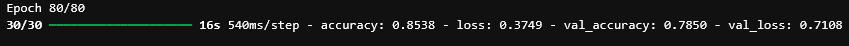
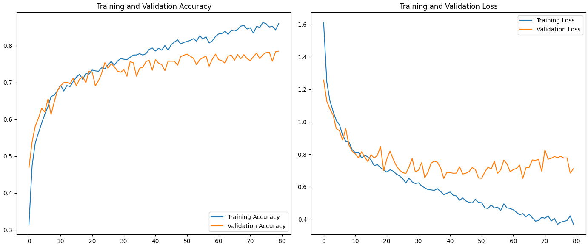

# Tulokset ja oma arviointi

[Ajettu notebook](TF_exercise_flowers_with_data_augmentation_exercise_NN.ipynb)

### Arviointi

1. Notebookin ajo toimii jupyterhubissa /test -kansiossa ilman ongelmia ja ajoaika on alle 60min (2p)

    - Koska toteutin tehtävän omatoimisesti puhtissa, ei minulla ollut mitään `/test` -kansiota, notebookin ajo kuitenkin toimii ilman ongelmia ja ajoaika on alle 60min. Tästä kohdasta siis 2/2 pistettä.

2. Neuroverkon tarkkuus validointidatalla on > 70% (1p)

    - Lopullinen validation accurancy oli 78.5%, eli tästäkin 1/1 piste

3. Notebookista löytyy Plot Training and Validation Graphs ja kuvasta/kuvista käyrät kaikki 4 käyrää [acc, val_acc, loss, val_loss]. (2p)

    - Kaikki neljä käyrää löytyvät plotattuna, eli tästäkin 2/2 pistettä.

Oma arvioini tehtävästä on 5/5 pistettä 