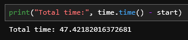
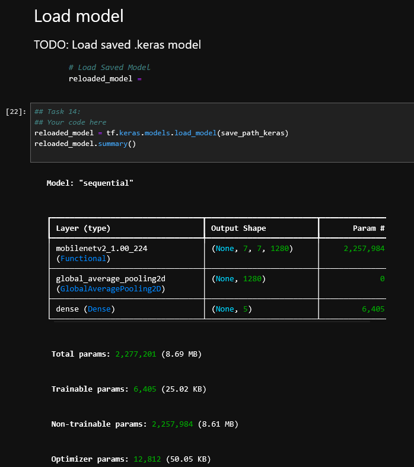
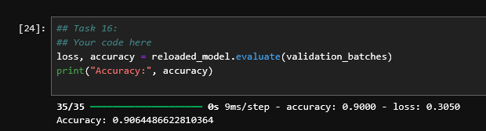

# Tulokset ja oma arviointi

[Ajettu notebook](TF_exercise_flowers_with_transfer_learning_exercise_NN.ipynb)

[Tallennettu neuroverkko](flowers_saved_NN.keras)

### Arviointi

1. Notebookin ajo toimii jupyterhubissa /test -kansiossa ilman ongelmia ja ajoaika on alle 10min  (2p)

    - Tämäkin tehtävä toteutettiin puhtissa omassa projektiympäristössä, ajo toimii ilman ongelmia ja ajoaika oli niinkin lyhyt kuin 47s, eli rutkasti alle 10min. Tästä kohdasta siis 2/2 pistettä.

2. Tallennettu neuroverkko toimii ongelmitta (2p)

    - Malli ladattiin onnistuneesti ilman virheitä ja sen rakenne vastaa koulutettua mallia. Lisäksi evaluointi validointidatalla toimii, joten tallennettu neuroverkko on täysin käyttökelpoinen. 2/2 pistettä.

3. Tallennetun neuroverkon tarkkuus validointidatalla on > 80% (1p)

    - Mallin validointitarkkuus on 0.90 ja ylittää vaaditun 80%. 1/1 pistettä

Oma arvioini tehtävästä on 5/5 pistettä 