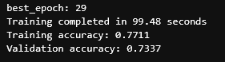
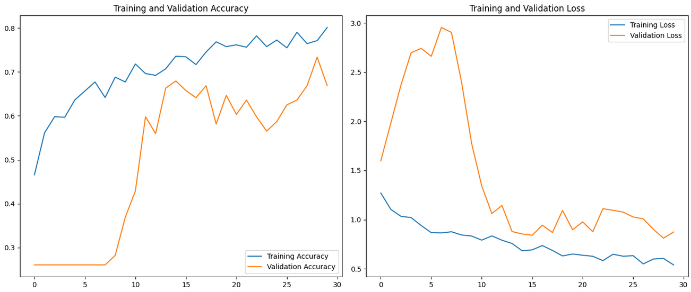
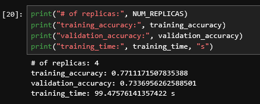

# Tulokset ja oma arviointi

[Ajettu notebook](TF_exercise_flowers_multiGPU_NN.ipynb)

### Arviointi

1. Notebookin ajo toimii jupyterhubissa /test -kansiossa ilman ongelmia ja ajoaika on alle 15 min (2p)

    - Tämäkin tehtävä toteutettiin puhtissa ja notebookin ajaminen tapahtui jopa alle 2 minuuttiin ja ilman ongelmia. 2/2 pistettä.

    

2. Neuroverkon tarkkuus validointidatalla on > 70% (1p)

    - Tässä koin suuria haasteita, melkein joka ajokerralla jonkun epocheista validation accuracy ylitti 0.70 mutta se ei koskaan päätynyt viimeiseksi tulokseksi. Ongelman ratkaisuksi käytin `keras.callbacks.ModelCheckpoint`:ia minkä avulla sain käyttöön parhaan epochin. Tämä saavutti 0.7337 validation accuracyn. 1/1 piste.

    

    

3. Notebookin viimeinen solu tulostaa arvot: # of replicas, training_accuracy, validation_accuracy, training_time. (2p)

    - Liitteenä kuva viimeisestä solusta ja sen tulosteesta. 2/2 pistettä.

    

Oma arvioni tehtävästä on 5/5 pistettä 