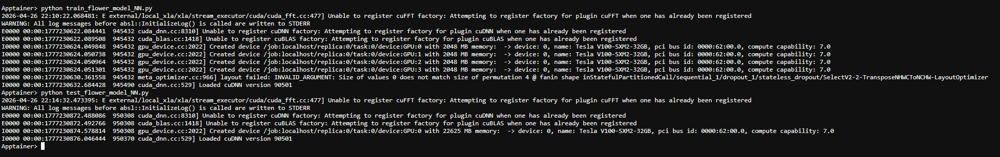
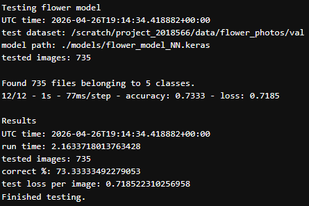
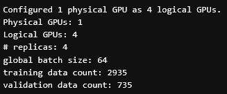
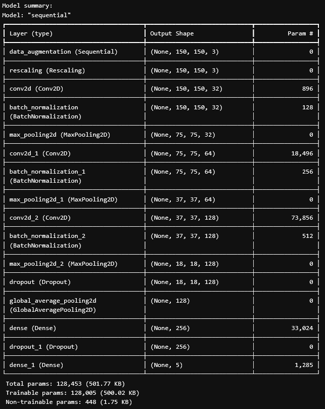
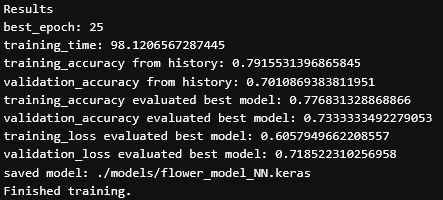

# Tulokset ja oma arviointi

[Train script](train_flower_model_NN.py)

[Train log](train_log.out)

[Test script](test_flower_model_NN.py)

[Test log](test_log.out)

[Koulutettu malli](https://github.com/airaksinenv/deeplearning-2/blob/main/3_Distribted_training/models/flower_model_NN.keras)

### Arviointi

1. Scriptien peräkkäinen ajo toimii jupyterhubissa ilman ongelmia ja yhteinen ajoaika on alle 15min (2p)

    - Scriptien ajo toimii ongelmitta ja kesto oli noin ~5min, testi scripti oli hyvin nopea ja melkein kaikki aika meni train scriptissä. 2/2 pistettä.

    

2. Neuroverkon tarkkuus testi datalla on > 60% (1p)

    - Tarkkuus pysyi ~70% missä se oli edellisessäkin tehtävässä, ylittää siis vaaditun 60%. 1/1 piste.

    

3. Kaikki vaaditut tiedostot, printit ja paluu arvot löytyy. (2p)

    -  replicas / global batch size / training data count

    

    -  model summary

    

    -  results

    

    -  UTC time / run time / tested images / correct % / test loss per image 

    

    - Näistä 2/2 pistettä

Oma arvioini tehtävästä on 5/5 pistettä 