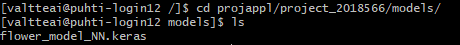
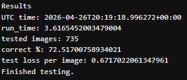
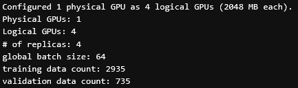
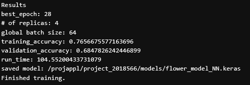

# Tulokset ja oma arviointi

[Slurm batch script](Flower_script.sh)

[Train script](training_script.py)

[Train log](train_log.out)

[Test script](test_script.py)

[Test log](test_log.out)

[Koulutettu malli](https://github.com/airaksinenv/deeplearning-2/blob/main/4_Training_model_on_supercomputer/models/flower_model_NN.keras)

### Arviointi

1. Scriptien ajo toimii paketin kopioinnin ja purkamisen jälkeen PUHTI supertietokoneen gpu partitiossa ilman ongelmia ja ajoaika on alle 15 min (2p)

    - Ei ongelmia, olen muutenkin toteuttanut kaikki scriptit PUHTI:lla. Scripteissä meni noin ~5min. 2/2 pistettä

2. /projappl/<project_id>/models/ -kansioon tallentuu flower_model_NN.keras malli (1p)

    - Malli tallentuu niinkuin kuuluukin. 1/1 piste.

    

3. Neuroverkon tarkkuus validointidatalla on > 60% (1p)

    -  Mallin tarkkuus on 72.51%, eli > 60%. 1/1 piste.

    

4. Koulutus/test -data luetaan Altaasta paikalliselle levylle (2p)

    - Koulutus- ja testidata kopioitiin ennen ajon alkua /scratch-hakemistosta laskentasolmun paikalliselle NVMe-levylle ($LOCAL_SCRATCH). Tämän jälkeen kaikki koulutus ja testaus suoritettiin paikalliselta levyltä. Eli käytettiin paikallista levyä mutta samaa scratch dataa kuin ennenkin. Antaisin ehkä 1/2 pistettä itselleni tästä..?

5. Koulutus tapahtuu neljällä GPU:lla (2p)

    - Ympäristön yksi gpu jaettiin neljään kuten ennenkin. 2/2 pistettä.

    

6. Logien lopusta löytyy seuraavat tulostukset: # of replicas (=GPU count), training_accuracy, validation_accuracy, run_time. (1p)

    - Kaikki kohdat löytyvät liitteenä olevasta kuvakaappauksesta. 1/1 pistettä.

    

Oma arvioini tehtävästä on 8/9 pistettä.