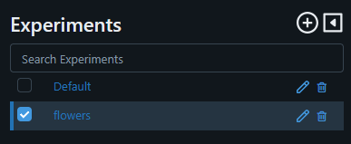
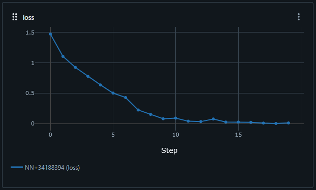
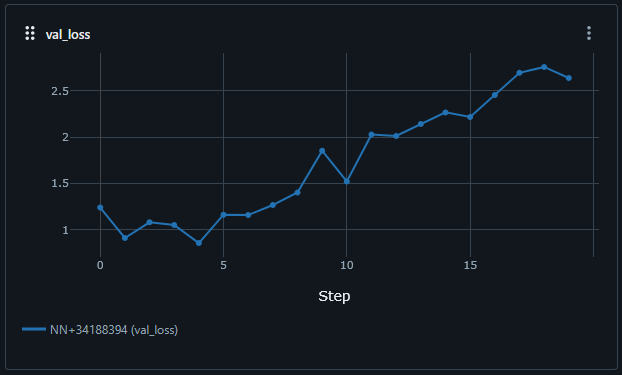
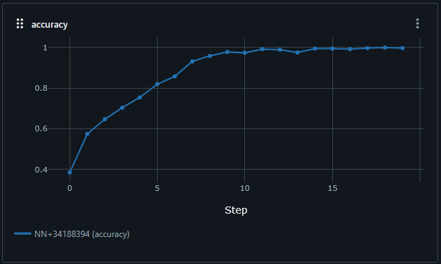
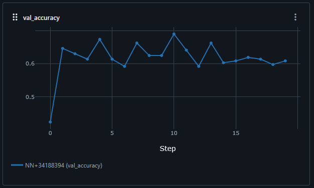
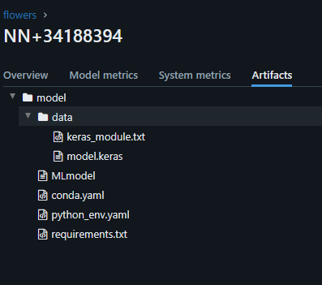
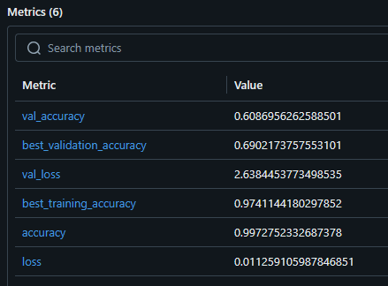

# Tulokset ja oma arviointi

[Muokattu Train script](training_script.py)

### Arviointi

1. Experiment näkyy MLflow käyttöliittymältä. (2p)

    - 2/2 pistettä

    

2. Experimentissä näkyy loss, val_loss, accuracy ja val_accuracy käyrät (1p)

    - Kaikki löytyy. 1/1 piste

    - Loss

    

    - Val_loss
    
    

    - Accuracy

    

    - Val_accuracy

    

3. Experimentistä löytyy model Artifacts -näkymästä. (1p)

    -  Löytyy. 1/1 piste.

    

4. Tarkkuus on > 70% (1p)

    - Tämä malli ei yltänyt yli 70%. Paras validation accuracy oli niinkin lähellä kuin 69%. 0/1 piste.

    

Oma arvioni tehtävästä on 4/5 pistettä.