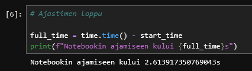
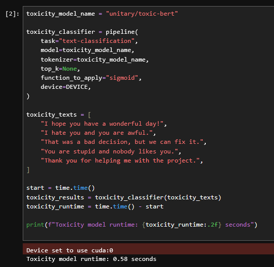
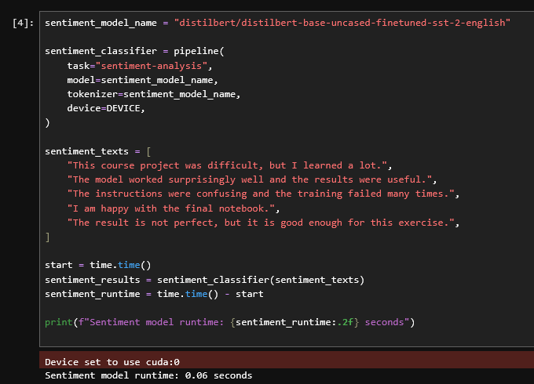
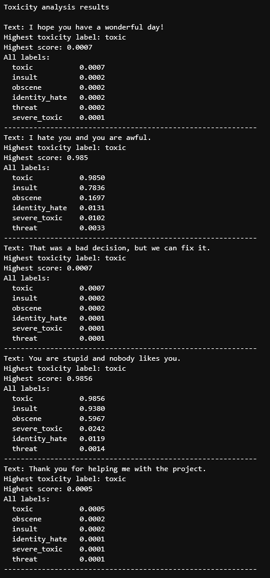
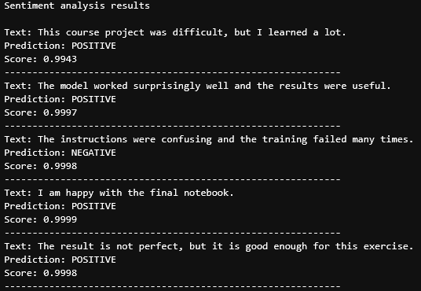
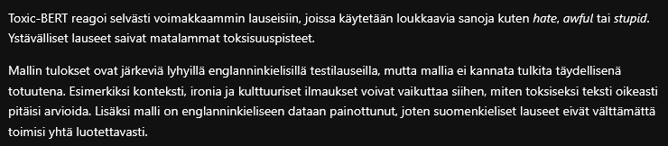
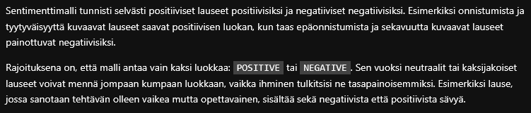

# Tulokset ja oma arviointi

[Ajettu notebook](huggingface_model_test_NN.ipynb)

### Arviointi

1. Notebookin ajo toimii jupyterhubissa /test -kansiossa ilman ongelmia ja ajoaika on alle 10min  (läpäisyehto)

    - Notebookin ajo tapahtui jopa alle 3 sekuntiin, ensimmäisellä kerralla kesti ehkä 10s kun mallit ladattiin mutta sekin oli todella nopeaa.

    

2. Notebookissa ladataan ja ajetaan kahta eri huggingface mallia (1p / malli)

    - 2/2 pistettä

    - Malli 1: toksisuuden tunnistus

    

    - Malli 2: sentimenttianalyysi

    

3. Notebookissa testataan malleja omalla datalla ja tulostetaan tulokset  (1p / malli)

    - 2/2 pistettä

    - Malli 1: toksisuuden tunnistus

    

    - Malli 2: sentimenttianalyysi

    

4. Notebookissa pohditaan saatuja tuloksia  (1p / malli)

    - 2/2 pistettä

    - Malli 1: toksisuuden tunnistus

    

    - Malli 2: sentimenttianalyysi

    

Oma arvioni tehtävästä on 6/6 pistettä.