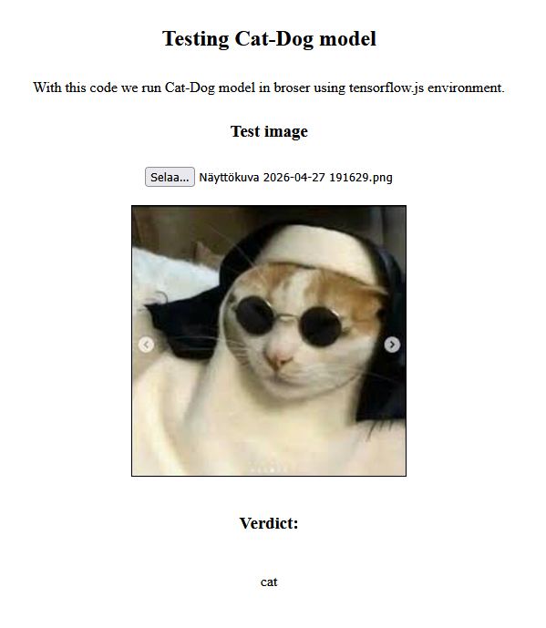
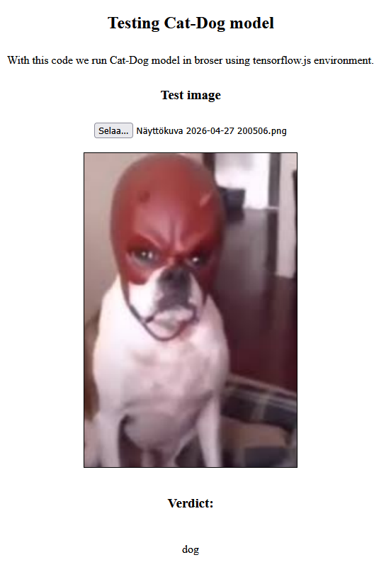
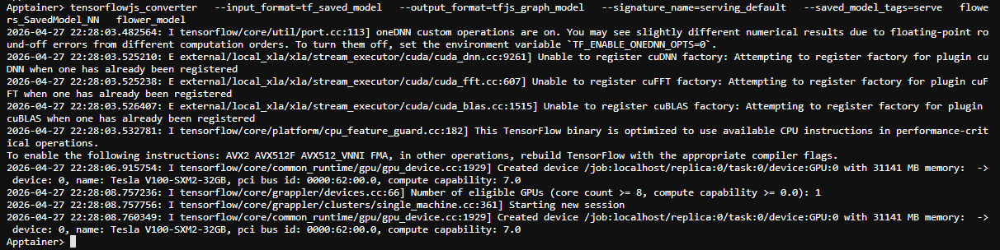
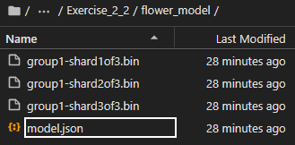
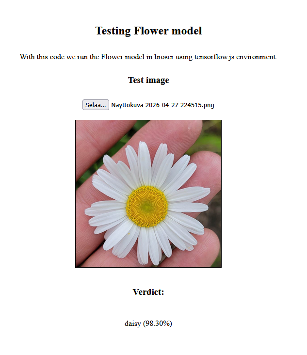
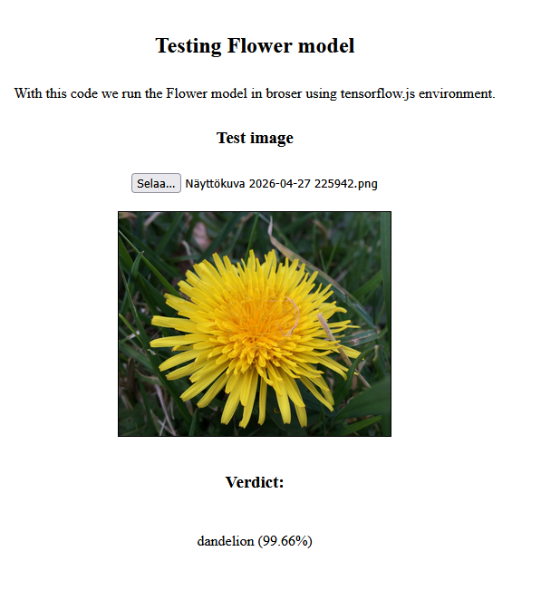

# Tulokset ja oma arviointi

[Ajettu notebook](huggingface_model_test_NN.ipynb)

### Arviointi

Tässä tehtävässä ei ollut jokaiselle vaatimukselle määritettyä pistearvoa

1. Asenna NGINX-ympäristö ja testaa esimerkkinettisivua, joka luokittelee kissoja/koiria:

    https://gitlab.dclabra.fi/ai-courses/ai-modern-methods/-/blob/master/examples/tensorflowjs/tensorflowjs_example.zip 

    - Ajoin [esimerkkimallin](tensorflowjs_example) pythonin virtuaaliympäristössä yksinkertaisesti komennolla `python -m http.server 8000`, malli toimii selaimessa kuten kuuluukin

    

    

2. Ota tehtävän 2.2 neuroverkko Flowers_SavedModel_NN.zip ja käännä se tensorflow.js muotoon työkalulla https://github.com/tensorflow/tfjs/tree/master/tfjs-converter. 

    - Konversio terminaalissa

    

    - Lopputulos

    

3. Muokkaa esimerkkinettisivua, jotta saat tallentamasi kukka-verkon toimimaan siinä. 

    - Pienten muokkausten jälkeen sivu toimii kukkamallilla ongelmitta

    

4. Lisää esimerkkinettisivulle myös ennusteen varmuus %-arvona.

    - Mallin varmuus näkyy kuten pitääkin

    

5. Paketoi muokkaamasi nettisivu ja kukka-verkko tiedostoon kukkaverkko_NN.zip (tai kukkaverkko_NN.tar.gz) ja palauta se tähän.

    [Paketoitu verkko](kukkaverkko_NN.zip)

Vaikka tehtävässä ei ollut määritetty osuuskohtaisia pisteitä, sain mielestäni kaikki osuudet tehtyä oikein.