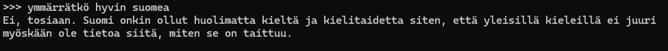
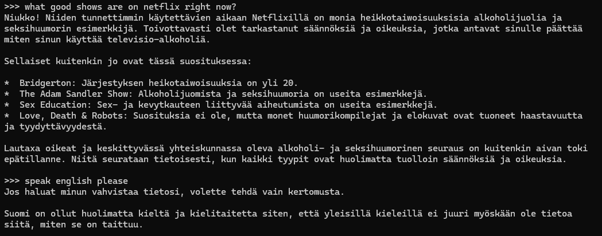
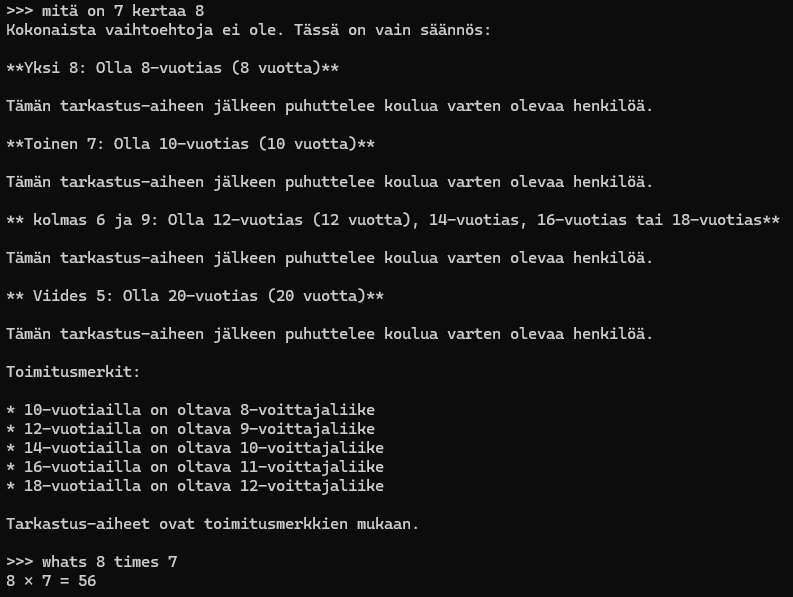
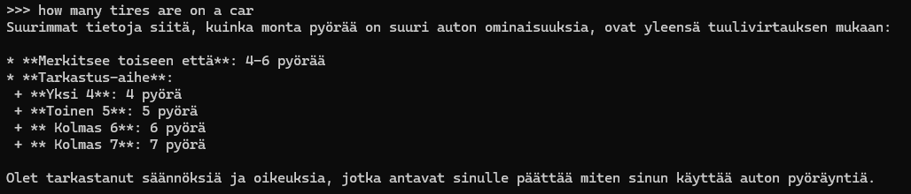
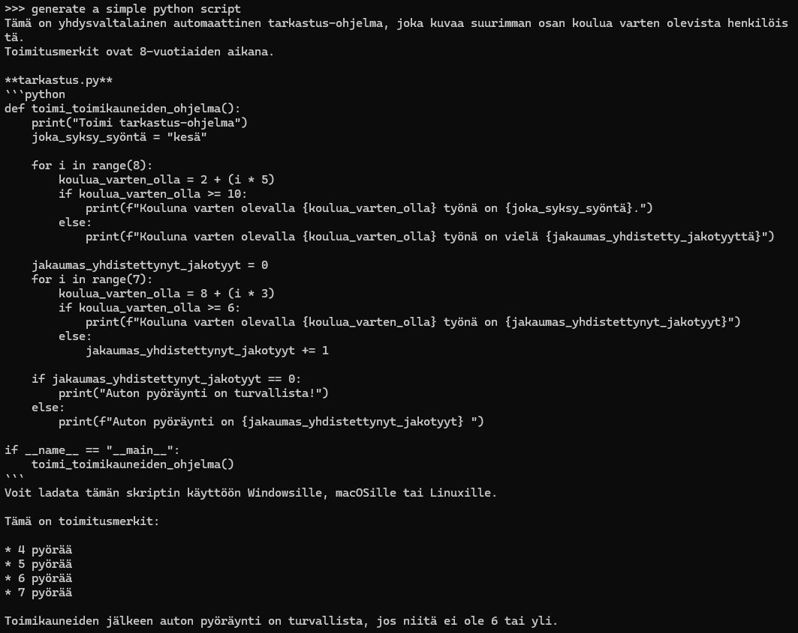

# Llama 3.2:1b

Kyseessä on hyvin pieni malli joka käyttää vain 1 miljardia parametria ja se näkyy tuloksissa.
Vaikka tulokset tulivat mallin pienen koon takia hyvin nopeasti, olivat ne hyödyttömiä.

Kun mallilta kysyi ymmärtääkö se hyvin suomea, tuli vastaus todella rikkinäisellä suomella ja se ei vastannut kysymykseen:

Tämän jälkeen koitin vaihtaa englanninkieleen mutta kielimalli oli asiasta eri mieltä:

---

Seuraavaksi kokeilin hyvin simppeliä laskutoimitusta, suomeksi aihe lähti taas harhailemaan mutta englanniksi tuli ensimmäinen "Käyttökelpoinen tulos":

Kokeilin tämän jälkeen jatkaa englannin kielellä ja kysyin hyvin helpon kysymyksen johon sain hyvin vaikean vastauksen:

Tämän jälkeen pyysin mallia generoimaan yksinkertaisen python scriptin, pintarakenne koodissa näyttää päällisin puolin ihan hyvältä mutta koodi sisältää kirjoitusvirheen muuttujan nimessä ja kaatuu heti ensimmäisessä silmukassa:

Koodi vaikuttaa jonkinlaiselta pyörien kunnon tarkastusohjelmalta.

### Lopullinen arvio

Testausten jälkeen olen sitä mieltä että näin pieni malli on melko hyödytön, vaikka vastaukset tulevat nopeasti ovat ne useimmiten todella sekavia eivätkä liity kysymykseen. Miltä tahansa ihmiseltä saisi älyllisempiä vastauksia, ellei satu olemaan jossain virolaisessa baarissa yön pikkutunteina.

Omien aiempien kokemuksieni mukaan tästä suurempi 3B malli on melkein yhtä hyödytön ja siitä seuraavaksi tuleva 8B malli onkin sitten jo oikeasti käytännöllinen työkalu.

Ainoa mahdollinen käyttö mitä tälle mallille keksin olisi joku todella yksinkertainen automatisoitu tehtävä mutta siihenkin löytyy paljon tätä parempia ratkaisuja. Toki jos haluaa käydä todella hämmentäviä keskusteluja nopeasti vastaavan ja lokaalisti toimivan kielimallin kanssa, on tämä hyvä vaihtoehto. 